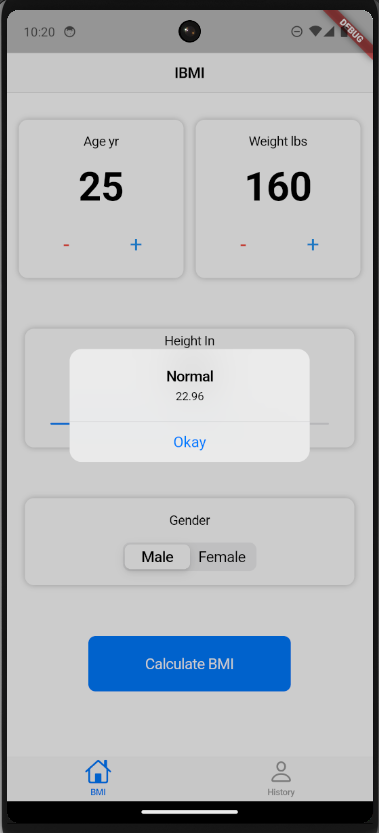

# IBMI

- IBMI is an engaging and beautiful IBMI calculation app developed with Flutter.
- It is based on Cupertino-styling.
- It uses sliding toggle and also stores last BMI calculated on history page.

## Product Image
,
,
,
